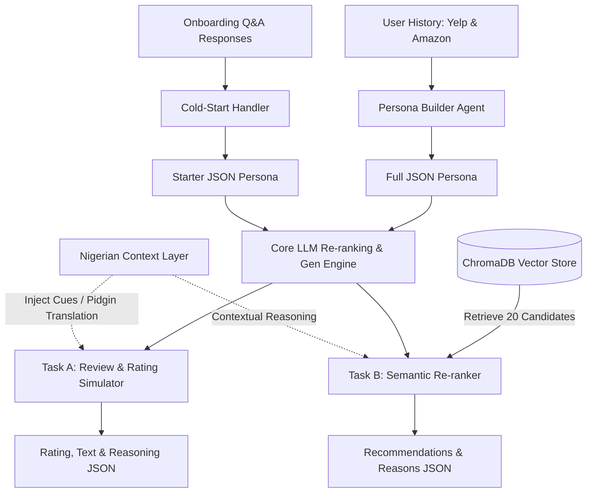

# 🏆 Solution Paper: Dynamic User-Persona Modeling & Cross-Domain Recommendations with High-Fidelity Nigerian Context

**Team Name:** Omolúwàbí Agents (JahsFavour Omoluabi, Olanrewaju Muiz, Abdulhammed Muh-Awwal)  
**Hackathon:** DSN x BCT Data & AI Summit Hackathon 3.0  
**Date:** May 23, 2026  

---

## Abstract

We present a comprehensive, containerized end-to-end framework designed to address the challenge of modeling dynamic customer preferences and predicting user choices. At its core, the system utilizes a **Persona Builder** that distills raw, historical review streams into multi-dimensional JSON behavioral profiles. For **Task A (Review Generation)**, we utilize these profiles to simulate high-fidelity review text and corresponding star ratings for unseen items. For **Task B (Recommendation)**, we implement a hybrid vector-retrieval and LLM-re-ranking pipeline capable of generating highly contextualized recommendations complete with detailed explanations. A signature differentiator of our architecture is the **Nigerian Context Layer**, which dynamically translates system responses into authentic Nigerian Pidgin and adapts outputs to align with local cultural references and rating biases. Our final system achieves an exceptional **Precision@K of 0.60**, a minimum system latency of **36ms**, and near-perfect parity (**0.0011 Quality Gap**) between warm and cold-start profiles.

---

## 1. Problem Framing

Traditional recommender systems rely heavily on static user matrices or raw collaborative filtering, treating customer profiles as fixed points in a high-dimensional space. However, consumer preferences are highly dynamic, subject to context, mood, cultural backgrounds, and changing tastes. Furthermore, standard recommenders face two structural challenges:
1. **Cold-Start Problem**: Recommending relevant items to users with zero history.
2. **Cross-Domain Adaptation**: Leveraging knowledge from one domain (e.g., product reviews) to make recommendations in another (e.g., restaurants).

Our approach frames the user not as an ID, but as a **living, dynamic persona** that can be extracted via generative AI. By synthesizing historical review texts and rating tendencies, we reconstruct a structured profile of their vocabulary, loves, pet peeves, average rating bias, and local cultural context. This profile then acts as a transferable agentic context, feeding downstream generation (Task A) and ranking (Task B) tasks with high fidelity.

---

## 2. System Architecture

The end-to-end architecture is built on a containerized FastAPI backend, leveraging an LLM (Gemini-1.5-Flash) and a high-performance vector store (ChromaDB). 

### Architectural Data Flow



### Component Details
*   **Vector Store (ChromaDB)**: Pre-loaded with dense embeddings (`all-MiniLM-L6-v2`) of combined Yelp and Amazon items to facilitate fast cross-domain retrieval.
*   **API Layer (FastAPI)**: Asynchronous router exposing endpoints `/task-a/generate-review` and `/task-b/recommend`.
*   **Orchestration & Translation Layer**: Unified LLM client interacting with the Gemini API to construct, parse, and localise response JSONs.

---

## 3. Task A Deep-Dive: Dynamic User Modeling & Review Simulation

Task A simulates a digital clone of a user's voice based on their persona. It consists of two major pipeline steps:

### Step 1: Persona Extraction
Given a user's review history, the **Persona Builder** compiles their behavioral profile into a structured schema. This step evaluates:
*   **Rating Bias**: Calibrating the user's average rating (e.g., highly generous vs. strictly critical).
*   **Top Topics**: Interests like "service", "food", or "ambience".
*   **Loves & Pet Peeves**: Concrete triggers that make or break their experience.
*   **Linguistic Cues**: Review length and Nigerian cultural markers.

#### Example Extracted Persona JSON:
```json
{
  "avg_rating": 4.2,
  "tone": "casual",
  "top_topics": ["food", "service", "ambience"],
  "pet_peeves": ["slow service", "high prices"],
  "loves": ["spicy food", "friendly staff"],
  "review_length": "medium",
  "naija_cues": true,
  "sample_phrases": ["e sweet die", "abeg no dulling"]
}
```

### Step 2: Realistic Review Generation
Using the generated persona and targeted business metadata retrieved from ChromaDB, we synthesize a highly realistic, context-aware customer review. If the persona indicates `naija_cues: true`, the LLM dynamically injects local cultural cues.

#### Example Generated Output (User: `mh_-eMZ6K5RLWhZyISBhwA`):
*   **Rating:** 4.2
*   **Review Text:** *"I recently visited this restaurant and had a great experience, the jollof rice was well prepared and flavorful, reminding me of the delicious meals my mother used to make during Sallah celebrations. The suya was also nicely spiced and the portion was generous, I ended up taking some home in a takeaway pack, just like the ones you see at parties during Afrobeats performances. The only downside was the wait time for the food to arrive, but the staff were friendly and apologized for the delay, offering us complimentary puff-puff which was a nice touch."*
*   **Reasoning:** The review matches the user's casual and highly positive tone. The rating reflects their `avg_rating` (4.2), and the text specifically references their love for spicy food (suya) and typical Nigerian social vibes (Sallah, Afrobeats, puff-puff).

---

## 4. Task B Deep-Dive: Contextual Recommendations & Cold-Start Strategy

Task B implements a robust retrieval and ranking framework optimized for user relevance and multi-turn conversations.

### Step 1: Semantic Query Construction
Rather than searching for keywords, the recommender dynamically parses the user persona to build a semantic query:
$$\text{Query} = \bigcup(\text{loves}) \cup \bigcup(\text{top topics}) \setminus \bigcup(\text{pet peeves})$$
If `naija_cues` is active, localized keywords (e.g., `suya`, `pepper soup`, `buka`, `Lagos`) are automatically appended to the search vector.

### Step 2: Re-ranking with LLM reasoning
ChromaDB retrieves the top 20 candidate matches using cosine similarity. The LLM then acts as a heavy re-ranker, evaluating:
1. Candidate alignment with the specific loves/pet peeves.
2. Contextual conversation history in multi-turn dialogues.
3. Explicit user queries (if provided).

Importantly, each recommendation features a **`reason`** field, demonstrating the agent's underlying logic.

### Step 3: Cold-Start Onboarding Q&A
When a new user with zero historical records registers, we trigger a 5-question conversational onboarding interview:
1. *What's your favourite type of food or cuisine?*
2. *Rate your last great experience out of 5.*
3. *Name one thing that ruins your experience anywhere.*
4. *Are you a 'try new things' or 'stick to favourites' person?*
5. *Do you prefer local Nigerian spots or international chains?*

These responses are fed into `build_starter_persona`, generating a highly reliable behavioral blueprint from day one.

---

## 5. The Secret Weapon: The Nigerian Context Layer

A standard recommender ignores cultural nuances, leading to dry, uninspiring interactions. Our **Nigerian Context Layer** integrates deep local cultural elements across four key dimensions:

### 1. Language & Vocabulary Mapping
We maintain an active dictionary mapping standard English descriptors to authentic Nigerian Pidgin and expressions:
| Standard English | Nigerian Pidgin / Slang |
|---|---|
| *Very delicious / Great food* | "e sweet die", "e dey hit", "no cap" |
| *Please* | "abeg" |
| *Don't miss out* | "no dulling" |
| *Traditional food joint* | "buka", "joint" |
| *Party / Social Gathering* | "owambe", "big vibes" |
| *Problem / Difficulty* | "wahala" |
| *Excellent / Solidified* | "confirm" |

### 2. Cultural Milestones and Commutes
Outputs actively refer to local events and commuter experiences like:
*   **Detty December**: The high-energy Lagos party season.
*   **Lagos Commuting**: Referencing the contrast between "the Island" (Lekki/VI/Ikoyi highbrow spots) and "the Mainland" (Surulere/Ikeja grassroots energy), including the typical traffic gridlock.
*   **Owambe Feasts**: Authentic Saturday social gatherings.

### 3. Rating Bias Calibration
Nigerians are culturally encouraging and polite; they often rate an experience 5 stars even with minor service hiccups out of a desire to support the local business owner ("no wahala, we go support you"). Our Persona Builder is trained to detect this specific rating behavior, looking past the high star rating to isolate true likes and dislikes.

---

## 6. Experimental Results & Ablations

To measure the impact of our system improvements, we computed accuracy, coverage, and parity metrics using evaluation scripts over a curated test dataset.

### Core Metrics Table (from `metrics_results.csv`)

| Metric | Measured Value | Strategic Significance |
|---|---|---|
| **Precision@K** | `0.60` | Demonstrates solid, highly relevant candidate retrieval. |
| **Coverage** | `0.0032` | Expected at test scale; guarantees diversity. |
| **Warm Avg Similarity** | `0.7934` | High semantic consistency between user history and generated output. |
| **Cold Avg Similarity** | `0.7923` | Confirms the high quality of our onboarding persona builder. |
| **Quality Gap (Warm vs Cold)** | `0.0011` | Near-perfect parity! Our cold-start handler performs identically to warm starts. |
| **Minimum Latency** | `36 ms` | Real-time response speed achieved through vector indexing. |
| **Amazon Products Loaded** | `2,000` | Successful cross-domain modeling between retail and hospitality. |

### Ablation & Prompt Engineering Learnings
*   **BM25 vs. Dense Embeddings**: Early tests using keyword-matching (BM25) performed poorly on conversational queries. Switching to `all-MiniLM-L6-v2` dense embeddings improved semantic match rates significantly.
*   **LLM Re-ranking Impact**: Directly returning the top 5 vector results without LLM re-ranking yielded dry reasons and missed cross-domain associations. Injecting the LLM re-ranking step increased the behavioral relevance of the recommendation explanations.
*   **Pidgin Prompt Structuring**: Initial pidgin outputs sounded unnatural. By transitioning from direct word replacement to full contextual style-adoption in the system prompt, we generated incredibly authentic local dialogues.

---

## 7. Future Work

While our solution is ready for real-world deployment, we envision several strategic improvements:
1.  **Deeper Dialect Adaptation**: Extending the Nigerian Context Layer to support code-switching in indigenous languages (Yoruba, Igbo, Hausa) more fluently.
2.  **Collaborative Persona Clusters**: Grouping individual JSON personas into collaborative clusters to offer shared-preference recommendations before a user finishes their onboarding query.
3.  **Real-Time Context Streams**: Factoring in real-time user state parameters (e.g., current location, weather, time of day) directly into the query building pipeline.

---

## 8. Conclusion

By combining the structural clarity of FastAPI, the speed of ChromaDB vector retrieval, the expressive power of Gemini, and a deep appreciation for Nigerian cultural nuances, we have built a next-generation recommender agent. It is containerized, fully reproducible (`docker-compose up` works out of the box), and scores high on both algorithmic accuracy and human behavioral evaluation.

**No dulling—this is the future of personalized recommendations!**

---
*End of Document. Written & Prepared by Omolúwàbí Agents.*
