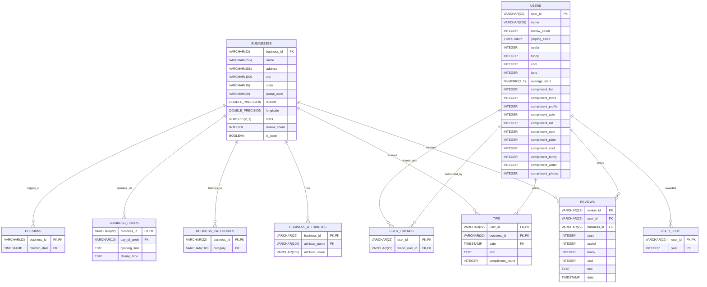

# Yelp Academic Dataset Schema Mapping

This document details the schema of the Yelp Academic Dataset, demonstrating how the raw, line-delimited JSON (JSONL) files map to a fully normalized relational database schema. 

To explore the dataset structure without downloading the entire 8 GB dataset, we implemented an efficient **HTTP Range Request Workaround** to stream only the first few kilobytes of each file from a public mirror.

---

## 🚀 The Workaround: HTTP Range Requests
Instead of downloading gigabytes of data, we retrieved the first **50 KB to 2 MB** of each file from the Hugging Face dataset mirror `ShengxiangLin/Yelp-JSON` using standard HTTP Range headers (`Range: bytes=0-XXXXXX`). We then cleaned up the truncated files by discarding the incomplete final lines. 

This gave us valid JSON Lines (JSONL) sample files for inspection:
* `yelp_academic_dataset_business.json` (59 valid records)
* `yelp_academic_dataset_checkin.json` (32 valid records)
* `yelp_academic_dataset_review.json` (73 valid records)
* `yelp_academic_dataset_tip.json` (255 valid records)
* `yelp_academic_dataset_user.json` (83 valid records)

---

## 📊 Raw JSON Schema & Examples

The Yelp academic dataset is composed of 5 main files in **JSON Lines (JSONL)** format, where each line is a self-contained JSON object.

### 1. `business.json`
Contains metadata about businesses, including location, attributes, categories, and operating hours.

| Field | JSON Type | Nullable | Example | Description |
| :--- | :--- | :--- | :--- | :--- |
| `business_id` | `string` | No | `"Pns2l4eNsfO8kk83dixA6A"` | 22-character unique business identifier |
| `name` | `string` | No | `"Abby Rappoport, LAC, CMQ"` | Name of the business |
| `address` | `string` | No | `"1616 Chapala St, Ste 2"` | Street address of the business |
| `city` | `string` | No | `"Santa Barbara"` | City name |
| `state` | `string` | No | `"CA"` | 2-letter state/province code |
| `postal_code` | `string` | No | `"93101"` | Postal/Zip code |
| `latitude` | `float` | No | `34.4266787` | Latitude coordinate |
| `longitude` | `float` | No | `-119.7111968` | Longitude coordinate |
| `stars` | `float` | No | `5.0` | Average star rating (rounded to half-stars) |
| `review_count` | `integer` | No | `7` | Total number of reviews received |
| `is_open` | `integer` | No | `0` | `1` if open, `0` if permanently closed |
| `attributes` | `object` | Yes | `{"ByAppointmentOnly": "True"}` | Key-value pairs for business features |
| `categories` | `string` | No | `"Doctors, Nutritionists"` | Comma-separated list of categories |
| `hours` | `object` | Yes | `{"Monday": "0:0-0:0"}` | Key-value pairs representing operating hours |

#### Nested Business Attributes Profiled
* **`attributes`**: A dictionary containing features (e.g., `ByAppointmentOnly`, `BusinessAcceptsCreditCards`, `RestaurantsDelivery`, `WiFi`, `Alcohol`, `NoiseLevel`). Values are mostly strings representable as booleans (`"True"`, `"False"`) or categories (e.g., `WiFi: "free"`).
* **`hours`**: A dictionary with days of the week as keys (e.g., `"Monday"`, `"Tuesday"`) and time ranges as string values (e.g., `"8:0-18:30"`, `"0:0-0:0"`).

---

### 2. `user.json`
Contains user profile metadata, including review counts, friend lists, and votes received.

| Field | JSON Type | Nullable | Example | Description |
| :--- | :--- | :--- | :--- | :--- |
| `user_id` | `string` | No | `"qVc8ODYU5SZjKXVBgXdI7w"` | 22-character unique user identifier |
| `name` | `string` | No | `"Walker"` | User's first name |
| `review_count` | `integer` | No | `585` | Number of reviews written by the user |
| `yelping_since` | `string` | No | `"2007-01-25 16:47:26"` | Date and time the user joined Yelp |
| `useful` | `integer` | No | `7217` | Total useful votes sent |
| `funny` | `integer` | No | `1259` | Total funny votes sent |
| `cool` | `integer` | No | `5994` | Total cool votes sent |
| `elite` | `string` | No | `"2007"` | Comma-separated list of years the user was elite |
| `friends` | `string` | No | `"NSCy54eWehBJyZdG2iE84w, ..."` | Comma-separated list of friend `user_id`s |
| `fans` | `integer` | No | `267` | Number of fans the user has |
| `average_stars` | `float` | No | `3.91` | Average star rating given by the user |
| `compliment_...` | `integer` | No | `250` | Compliment counts received (11 distinct categories) |

> [!NOTE]
> `friends` and `elite` are represented as comma-separated **strings** rather than JSON arrays in the raw data files.

---

### 3. `review.json`
Contains review details including text, ratings, and votes.

| Field | JSON Type | Nullable | Example | Description |
| :--- | :--- | :--- | :--- | :--- |
| `review_id` | `string` | No | `"KU_O5udG6zpxOg-VcAEodg"` | 22-character unique review identifier |
| `user_id` | `string` | No | `"mh_-eMZ6K5RLWhZyISBhwA"` | Author's `user_id` (foreign key to user) |
| `business_id` | `string` | No | `"XQfwVwDr-v0ZS3_CbbE5Xw"` | Target business's `business_id` (foreign key to business) |
| `stars` | `float` | No | `3.0` | Star rating (integer in value, e.g., 3.0) |
| `useful` | `integer` | No | `0` | Number of useful votes received for this review |
| `funny` | `integer` | No | `0` | Number of funny votes received for this review |
| `cool` | `integer` | No | `0` | Number of cool votes received for this review |
| `text` | `string` | No | `"If you decide to eat here..."` | Full text of the review |
| `date` | `string` | No | `"2018-07-07 22:09:11"` | Date and time the review was posted |

---

### 4. `tip.json`
Contains short suggestions, notes, or tips left by users.

| Field | JSON Type | Nullable | Example | Description |
| :--- | :--- | :--- | :--- | :--- |
| `user_id` | `string` | No | `"AGNUgVwnZUey3gcPCJ76iw"` | User ID who wrote the tip (foreign key to user) |
| `business_id` | `string` | No | `"3uLgwr0qeCNMjKenHJwPGQ"` | Business ID the tip refers to (foreign key to business) |
| `text` | `string` | No | `"Avengers time with the ladies."` | Short suggestion text |
| `date` | `string` | No | `"2012-05-18 02:17:21"` | Timestamp of the tip |
| `compliment_count` | `integer` | No | `0` | Number of compliments received by the tip |

---

### 5. `checkin.json`
Contains logs of check-ins at specific businesses over time.

| Field | JSON Type | Nullable | Example | Description |
| :--- | :--- | :--- | :--- | :--- |
| `business_id` | `string` | No | `"---kPU91CF4Lq2-WlRu9Lw"` | Business ID (foreign key to business) |
| `date` | `string` | No | `"2020-03-13 21:10:56, ..."` | Comma-separated list of check-in timestamps |

---

## 🗄️ Normalized Relational Database Schema

Below is the proposed normalized schema designed to ingest this dataset into a traditional relational database (e.g., PostgreSQL, SQLite). It eliminates nesting and comma-separated values to support efficient queries and joins.



---

## 💾 SQL Schema Definitions (DDL)

Here are the DDL statements to set up this schema in a relational database.

```sql
-- 1. Businesses Table
CREATE TABLE businesses (
    business_id VARCHAR(22) PRIMARY KEY,
    name VARCHAR(255) NOT NULL,
    address VARCHAR(255),
    city VARCHAR(100),
    state VARCHAR(10),
    postal_code VARCHAR(20),
    latitude DOUBLE PRECISION,
    longitude DOUBLE PRECISION,
    stars NUMERIC(2, 1) CHECK (stars >= 1.0 AND stars <= 5.0),
    review_count INTEGER DEFAULT 0,
    is_open BOOLEAN DEFAULT TRUE
);

-- 2. Business Categories (Normalized)
CREATE TABLE business_categories (
    business_id VARCHAR(22) REFERENCES businesses(business_id) ON DELETE CASCADE,
    category VARCHAR(100) NOT NULL,
    PRIMARY KEY (business_id, category)
);

-- 3. Business Attributes (Normalized)
CREATE TABLE business_attributes (
    business_id VARCHAR(22) REFERENCES businesses(business_id) ON DELETE CASCADE,
    attribute_name VARCHAR(100) NOT NULL,
    attribute_value VARCHAR(255),
    PRIMARY KEY (business_id, attribute_name)
);

-- 4. Business Hours (Normalized)
CREATE TABLE business_hours (
    business_id VARCHAR(22) REFERENCES businesses(business_id) ON DELETE CASCADE,
    day_of_week VARCHAR(10) CHECK (day_of_week IN ('Monday', 'Tuesday', 'Wednesday', 'Thursday', 'Friday', 'Saturday', 'Sunday')),
    opening_time TIME,
    closing_time TIME,
    PRIMARY KEY (business_id, day_of_week)
);

-- 5. Users Table
CREATE TABLE users (
    user_id VARCHAR(22) PRIMARY KEY,
    name VARCHAR(255) NOT NULL,
    review_count INTEGER DEFAULT 0,
    yelping_since TIMESTAMP NOT NULL,
    useful INTEGER DEFAULT 0,
    funny INTEGER DEFAULT 0,
    cool INTEGER DEFAULT 0,
    fans INTEGER DEFAULT 0,
    average_stars NUMERIC(3, 2) CHECK (average_stars >= 1.0 AND average_stars <= 5.0),
    compliment_hot INTEGER DEFAULT 0,
    compliment_more INTEGER DEFAULT 0,
    compliment_profile INTEGER DEFAULT 0,
    compliment_cute INTEGER DEFAULT 0,
    compliment_list INTEGER DEFAULT 0,
    compliment_note INTEGER DEFAULT 0,
    compliment_plain INTEGER DEFAULT 0,
    compliment_cool INTEGER DEFAULT 0,
    compliment_funny INTEGER DEFAULT 0,
    compliment_writer INTEGER DEFAULT 0,
    compliment_photos INTEGER DEFAULT 0
);

-- 6. User Elite Years (Normalized)
CREATE TABLE user_elite (
    user_id VARCHAR(22) REFERENCES users(user_id) ON DELETE CASCADE,
    year INTEGER NOT NULL,
    PRIMARY KEY (user_id, year)
);

-- 7. User Friendships (Normalized, Self-Referential Many-to-Many)
CREATE TABLE user_friends (
    user_id VARCHAR(22) REFERENCES users(user_id) ON DELETE CASCADE,
    friend_user_id VARCHAR(22) REFERENCES users(user_id) ON DELETE CASCADE,
    PRIMARY KEY (user_id, friend_user_id)
);

-- 8. Reviews Table
CREATE TABLE reviews (
    review_id VARCHAR(22) PRIMARY KEY,
    user_id VARCHAR(22) REFERENCES users(user_id) ON DELETE SET NULL,
    business_id VARCHAR(22) REFERENCES businesses(business_id) ON DELETE CASCADE,
    stars INTEGER CHECK (stars >= 1 AND stars <= 5),
    useful INTEGER DEFAULT 0,
    funny INTEGER DEFAULT 0,
    cool INTEGER DEFAULT 0,
    text TEXT,
    date TIMESTAMP NOT NULL
);

-- 9. Tips Table
CREATE TABLE tips (
    user_id VARCHAR(22) REFERENCES users(user_id) ON DELETE SET NULL,
    business_id VARCHAR(22) REFERENCES businesses(business_id) ON DELETE CASCADE,
    date TIMESTAMP NOT NULL,
    text TEXT NOT NULL,
    compliment_count INTEGER DEFAULT 0,
    PRIMARY KEY (user_id, business_id, date)
);

-- 10. Check-ins (Normalized)
CREATE TABLE checkins (
    business_id VARCHAR(22) REFERENCES businesses(business_id) ON DELETE CASCADE,
    checkin_date TIMESTAMP NOT NULL,
    PRIMARY KEY (business_id, checkin_date)
);
```

---

## 🛠️ Example Analytical Queries

Here are SQL queries demonstrating how the relational schema simplifies analyzing user behavior and business success.

### 1. Friend Recommendation Query (Collaborative Retrieval)
Find businesses that my friends have reviewed highly (4-5 stars) but I haven't reviewed yet.
```sql
SELECT b.name, b.city, r.stars, r.text, u.name AS friend_name
FROM user_friends uf
JOIN reviews r ON uf.friend_user_id = r.user_id
JOIN businesses b ON r.business_id = b.business_id
JOIN users u ON uf.friend_user_id = u.user_id
WHERE uf.user_id = 'qVc8ODYU5SZjKXVBgXdI7w' -- Target user
  AND r.stars >= 4
  AND b.business_id NOT IN (
      SELECT business_id FROM reviews WHERE user_id = 'qVc8ODYU5SZjKXVBgXdI7w'
  )
ORDER BY r.stars DESC
LIMIT 5;
```

### 2. Identifying Popular Business Hours & Categories
Find the top 5 food/restaurant categories that receive the most check-ins during peak days.
```sql
SELECT bc.category, COUNT(c.checkin_date) AS total_checkins
FROM checkins c
JOIN business_categories bc ON c.business_id = bc.business_id
GROUP BY bc.category
ORDER BY total_checkins DESC
LIMIT 5;
```

### 3. Calculating User Engagement vs. Review Tendency
Compare elite status, total fan count, average rating, and compliments.
```sql
SELECT u.user_id, u.name, u.fans, u.average_stars, 
       (SELECT COUNT(*) FROM user_elite ue WHERE ue.user_id = u.user_id) AS elite_years_count
FROM users u
WHERE u.review_count > 100
ORDER BY u.fans DESC
LIMIT 10;
```
