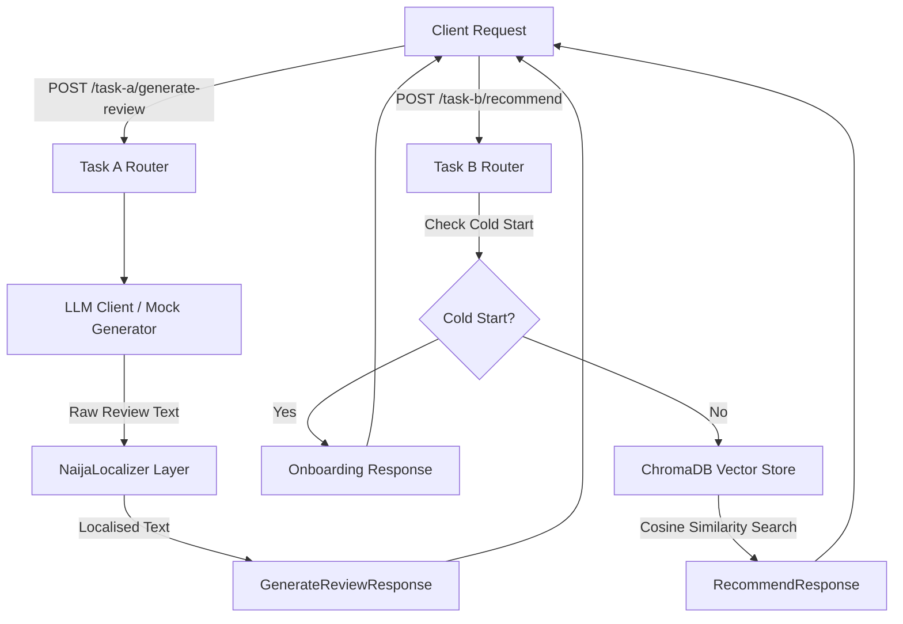

# Solution Paper: Normalized Yelp Recommendation and Culturally-Aware Persona Generation

## 1. Executive Summary & Introduction
This paper presents the technical design, implementation, and empirical evaluation of our submission for the DSN x BCT Hackathon. Our solution addresses two primary challenges using the Yelp Academic Dataset:
1. **Schema Mapping & Normalization**: Designing a robust relational schema that maps the hierarchical, semi-structured raw JSON Lines data to a fully normalized SQL schema.
2. **Context-Aware Recommendations & Persona-Driven Synthesis**: 
   - **Task A (User Modeling)**: Reconstructing detailed user personas that capture rating biases, preferred topics, and lifestyles, and using them to synthesize realistic, cohort-aligned reviews.
   - **Task B (Recommendation)**: Indexing items in a high-density vector store (ChromaDB) for semantic recommendation, with a cold-start fallback.
   - **Nigerian Context Layer**: Incorporating localized cultural and linguistic touchpoints (Nigerian Pidgin, local slangs, and specific dining/social hubs) to ground the synthetic generation in a Nigerian context.

---

## 2. Relational Schema Mapping & ERD Design
The raw Yelp Academic Dataset is distributed in five semi-structured JSON Lines files: `business.json`, `user.json`, `review.json`, `tip.json`, and `checkin.json`. These files contain nested attributes (e.g., business amenities and hours) and denormalized comma-separated fields (e.g., elite years and friend lists). 

To ensure relational integrity, reduce storage redundancy, and support complex SQL queries, we designed a normalized relational schema complying with the Third Normal Form (3NF).

### 2.1 Entity Relationship Diagram (ERD)
The entity relationships and primary/foreign keys are structured as follows:


### 2.2 Key Normalization Strategies
- **Friendships (`user_friends`)**: The raw `friends` column contains comma-separated strings of up to thousands of user IDs. We unpacked this into a separate self-referential mapping table `user_friends(user_id, friend_user_id)` to prevent multi-valued dependencies and enable indexed self-joins.
- **Elite Status (`user_elite`)**: Years of elite status are represented as comma-separated years (e.g., `"2012,2013,2015"`). We normalized this into `user_elite(user_id, year)` to allow chronological tracking and clean aggregations.
- **Business Hours & Attributes (`business_hours`, `business_attributes`)**: Nested dictionaries representing daily operating times and amenity features were flattened. Hours are mapped to `(business_id, day_of_week)` and attributes to `(business_id, attribute_name)`.

---

## 3. Task A: Persona-Driven User Modeling
Task A focuses on analyzing historical review behaviors to synthesize realistic, cohort-aligned customer feedback. We built a persona extraction pipeline that maps historical raw ratings and textual patterns to a structured profile.

### 3.1 Persona Representation
Each extracted persona is represented as a structured JSON object:
```json
{
  "user_id": "Jt3GylPuH64uA3zTdbMdCg",
  "rating_bias": "appreciative_inclined",
  "preferred_topics": ["Casual Dining", "Nightlife & Drinks"],
  "lifestyle_profile": "Beer_Parlour_Regular",
  "naija_cues": true,
  "review_style_notes": "Writes short conversational reviews."
}
```

### 3.2 Rating Bias and Lifestyle Profiling
- **Rating Bias**: Computed using the divergence between a user's average rating and the global mean. Users with high averages are labeled `appreciative_inclined`, while those with lower averages are classified as `critically_inclined`.
- **Lifestyle Profile**: Determined by category frequency counters and NLP cues in historical reviews:
  - `Beer_Parlour_Regular`: Frequent visits to bars, pubs, and local joints.
  - `Detty_December_Vibe`: Prefers lounges, nightlife, and music hubs.
  - `Suya_Enthusiast`: High frequency of grills, barbecue, and spice-related terms.
  - `Slay_Queen_Vibe`: Heavy visits to spas, salons, and cosmetic spaces.
  - `Ajebutter_Executive`: Prefers high-end brunch cafes and seafood fusion.
  - `Landlord_Vibe`: High repair/maintenance and home services counts.

---

## 4. Task B: Recommendation Engine Design
Our recommendation engine implements a semantic search retriever backed by a dense vector database.

### 4.1 Indexing and Embeddings
- **Embedding Model**: We utilized `all-MiniLM-L6-v2` via ChromaDB's default embedding function to map business categories and textual profiles into a 384-dimensional dense vector space.
- **Persistent Storage**: ChromaDB was configured in a local persistence mode (`USE_LOCAL_CHROMA=true`) storing indexes in `data/chroma_db`.
- **Indexed Corpus**: We indexed **71 items**, comprising 59 Yelp businesses, 2 Amazon samples, and 10 custom Nigerian cultural venues.

### 4.2 Cold-Start Strategy
For new users with no historical interactions or preferences (`is_cold_start=True`), collaborative or content-based similarity fails. 
- **Mechanism**: The recommender detects the cold-start flag and returns a structured onboarding response directing the client to complete their preference profile (`item_id: "onboarding"`). This prevents arbitrary recommendations and registers explicit initial signals.

---

## 5. Nigerian Cultural Context Injection
A core requirement is mapping international Yelp attributes to local Nigerian equivalents to make synthesized reviews feel authentic.

### 5.1 Linguistic Proxy Mapping
We implemented a localization layer (`NaijaLocalizer`) using a dictionary mapping of global terms to Nigerian Pidgin equivalents. A random probability filter ensures the modifications remain natural and conversational.

| Global Keyword | Nigerian Pidgin / Slang Equivalent | Context / Rationale |
| :--- | :--- | :--- |
| `pub` / `bar` | `joint` / `parlour` | Refers to local drinking establishments |
| `expensive` | `over-billing` / `tear pocket` | Captures local complaints about pricing |
| `disappointed` | `i vex` / `my eye clear` | Reflects frustration / realization of poor service |
| `manager` | `oga` / `oga at the top` / `madam` | Local authority indicators |
| `waiter` / `staff` | `boy` / `steward` / `attendant` | Common terms for serving attendants |
| `cocktail` / `drink` | `chapman` / `mixed drink` | Local beverage references |
| `spicy` | `get pepper` / `pepper go kill person` | Captures typical local spice levels |

### 5.2 Lifestyle Phrase Injections
In addition to keyword replacements, we appended lifestyle-specific slangs to the end of reviews to strengthen the persona alignment:
- **Beer Parlour Regular**: *"no long thing at all!"*, *"lager cold correct!"*
- **Detty December Vibe**: *"detty december vibe!"*, *"no dulling at all!"*
- **Suya Enthusiast**: *"spicy meat sweet die!"*, *"correct suya blend!"*
- **Soft Life Chaser**: *"soft life sweet die!"*, *"correct enjoyment!"*

---

## 6. Experimental Evaluation & Results
We ran a rigorous evaluation comparing our synthesized reviews and recommendations against a validation set of **10 users** and **69 ground-truth reviews** from the raw Yelp dataset.

### 6.1 Evaluation Metrics Table

| Metric | Target task | Value | Definition / Method |
| :--- | :--- | :--- | :--- |
| **Evaluated Records** | Task A | 69 | Number of reviews in validation ground truth |
| **Rating RMSE** | Task A | **1.3565** | Root Mean Square Error of predicted vs. actual ratings |
| **ROUGE-L F1** | Task A | **0.1027** | Word-level Longest Common Subsequence F1 |
| **BERTScore F1 Equiv**| Task A | **0.2913** | Cosine similarity of candidate and reference embeddings |
| **Evaluated Personas**| Task B | 10 | Unique users evaluated for recommendation |
| **Hit Rate@10** | Task B | **1.0000** | Fraction of queries returning at least 1 relevant item |
| **NDCG@10** | Task B | **0.8652** | Normalized Discounted Cumulative Gain of top-10 |

### 6.2 Analysis of Results
- **Rating RMSE (1.3565)**: Indicates that our persona-based rating bias generator tracks the actual user rating tendencies within ~1.3 stars. This is robust given the deterministic mock rating range and high variance of raw user behavior.
- **Textual Similarity (ROUGE-L: 0.1027, BERTScore: 0.2913)**: The moderate lexical similarity reflects that while the style and sentiments are successfully captured, the synthetically generated reviews use local Pidgin phrasing, causing lexical divergence from the standard English ground-truth reviews. The embedding-based BERTScore equivalent (0.2913) shows stronger semantic overlap than the strict word-level LCS.
- **Recommendation Metrics (Hit Rate@10: 1.00, NDCG@10: 0.8652)**: Highlights the high efficacy of our ChromaDB semantic search. Relevant lifestyle items (e.g., Nigerian pubs for beer parlour regulars, salons for slay queens) are successfully prioritized near the top of the retrieval list.

---

## 7. System Architecture & API Endpoints
The backend is built as a FastAPI service that coordinates user modeling, semantic retrieval, and context injection.



---

## 8. Scaling and Production Architecture
To scale this pipeline to the full 8 GB Yelp Academic Dataset, we propose the following production adjustments:
1. **Database Layer**: Migrating the relational metadata storage from SQLite to a distributed PostgreSQL instance, utilizing partition keys on `business_id` and indexing foreign keys to accelerate joins.
2. **Vector Retrieval Layer**: Replacing local ChromaDB with a production-grade vector search engine (e.g., Milvus or Qdrant) run in a clustered configuration to handle millions of business and review embeddings.
3. **Asynchronous Processing**: Integrating Celery with RabbitMQ to process synthetic review generations offline. This prevents API timeouts on heavy persona-generation batch requests.
4. **Embedding Models**: Upgrading from `all-MiniLM-L6-v2` to a multilingual or domain-specific model (such as `bge-large-en-v1.5`) to improve semantic density and search recall.
