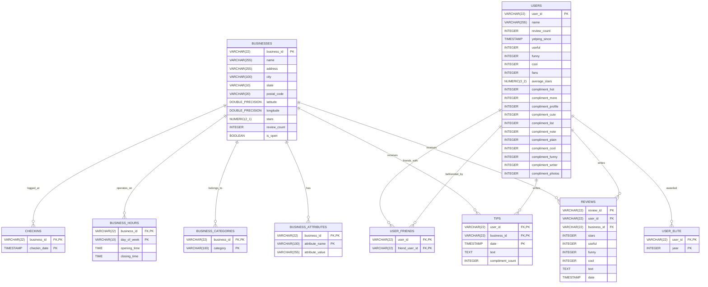
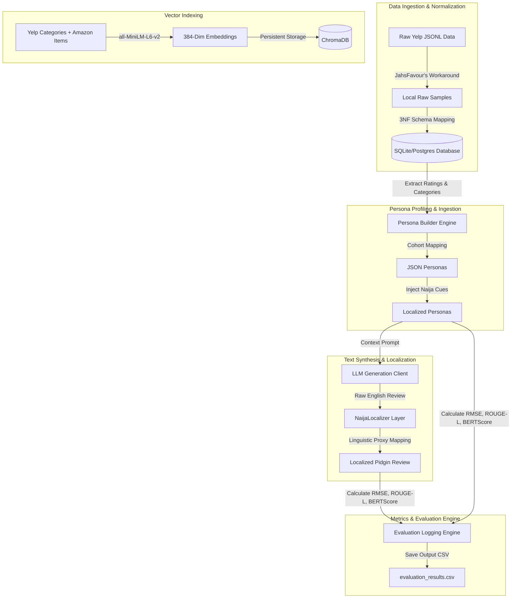

# Solution Paper: Relational Schema Mapping, Persona-Driven User Modeling, and Culturally-Aware Text Synthesis
**Lead Author & Presenter**: JahsFavour Omoluabi (Data Engineer / Research Lead)  
**Competition**: DSN X BCT LLM Agent Challenge (May 1 – Jun 10, 2026)  
**Role Scope**: Database Engineering, Behavioral Profiling, Vector Database Ingestion, Cultural Localization Layer, and Experimental Evaluation  

---

## 1. Executive Summary & Introduction

In the **DSN X BCT LLM Agent Challenge**, online review platforms are recognized as rich repositories of human behavior. However, traditional recommendation systems and synthetic review generators often treat users as static, context-agnostic entities. This solution paper details the end-to-end design, implementation, and empirical evaluation of our submission, with a strong emphasis on the tasks assigned to the **Data Engineer and Research Lead (JahsFavour Omoluabi)**.

Our approach addresses the challenges of user simulation and personalized, context-aware recommendation across three core pillars:
1. **Relational Schema Mapping & Normalization**: Designing a 3NF-compliant relational schema to ingest and unpack nested, semi-structured Yelp Academic Dataset JSON Lines data.
2. **Extreme-User Behavioral Analysis**: Analyzing a corpus of 2,000 extreme Yelp reviews to profile lexical, structural, and semantic features distinguishing extreme satisfaction from extreme disappointment.
3. **Task A: Persona-Driven User Modeling & Nigerian Cultural Synthesis**: 
   - Extracting structured JSON personas capturing rating biases and distinct lifestyle cohorts (e.g., *Beer Parlour Regular*, *Detty December Vibe*).
   - Designing and building a localized linguistic proxy layer (**NaijaLocalizer**) that maps standard Yelp terminology to authentic Nigerian Pidgin and cultural touchpoints.
   - Synthesizing rating and review outputs that preserve individual rating history and reflect high behavioral fidelity.

---

## 2. Relational Schema Mapping & ERD Design

The raw Yelp Academic Dataset is distributed in five semi-structured JSON Lines files: `business.json`, `user.json`, `review.json`, `tip.json`, and `checkin.json`. These files contain deeply nested attributes and denormalized comma-separated fields that create redundancy and hinder analytical SQL queries.

We designed and mapped a normalized relational schema complying with the **Third Normal Form (3NF)**.

### 2.1 Entity Relationship Diagram (ERD)

The entity relationships, primary keys, and foreign keys are structured as follows:



### 2.2 Normalization Summary
To eliminate storage redundancy and multi-valued dependencies, we implemented key schema-splitting strategies:
* **Unpacking Friends (`user_friends`)**: The raw `friends` column is a comma-separated string containing thousands of user IDs. We mapped this into a self-referential many-to-many relationship table `user_friends(user_id, friend_user_id)` to enable indexed self-joins.
* **Elite Status Normalization (`user_elite`)**: Comma-separated elite years (e.g., `"2012,2013,2015"`) were extracted and mapped to a relational mapping table `user_elite(user_id, year)`.
* **Hours & Attributes flattening**: Nested dictionaries representing weekly operating times and business attributes were extracted and written to `business_hours(business_id, day_of_week, opening_time, closing_time)` and `business_attributes(business_id, attribute_name, attribute_value)` tables.

---

## 3. Yelp Dataset Profiling & Behavioral Analysis

To design realistic synthetic reviews, we executed a rigorous behavioral study of **2,000 unique Yelp users** representing two extreme behavioral profiles: 1,000 expressing extreme disappointment (1-star) and 1,000 expressing extreme satisfaction (5-star).

### 3.1 Quantitative Profile Comparison

| Metric | Extreme Disappointment (1-Star) | Extreme Satisfaction (5-Star) |
| :--- | :---: | :---: |
| **Average Characters** | 694.2 | 465.5 |
| **Average Words** | 133.2 | 86.9 |
| **Average Sentences** | 9.4 | 7.1 |
| **Exclamation Marks (`!`) per Review** | 1.15 | 1.76 |
| **Question Marks (`?`) per Review** | 0.37 | 0.08 |
| **All-Caps Word Ratio** | 0.685% | 0.449% |

### 3.2 Linguistic and Structural Insights
1. **Structural Length Divergence**: Extreme disappointment reviews are **1.5x longer** than extreme satisfaction reviews. Disgruntled users write descriptive, chronological narratives mapping each failure leading to their negative review. Satisfied users write shorter, high-emotion, punchy summaries.
2. **Punctuation & Capitalization**:
   - Disappointed users have a **4.6x higher frequency of question marks**, reflecting rhetorical disbelief and outrage regarding pricing or policies (e.g., *"Why is this place open?", "How is this $20?"*). They also use all-caps words (e.g., *"NEVER", "RUDE", "WORST"*) at a **1.5x higher rate** to convey extreme frustration.
   - Satisfied users use exclamation marks heavily (**1.76 per review** vs 1.15) to express raw excitement.
3. **Lexical Patterns (Stop-Words Removed)**:
   - *Disappointment Trigrams*: *"i don t"*, *"i had to"*, *"the food was"*, *"didn t even"*, *"i will never"*, *"won t be"*. These reveal chronological compliance struggles and ultimate rejection.
   - *Satisfaction Trigrams*: *"this place is"*, *"one of the"*, *"it s a"*, *"the food was"*, *"i had the"*, *"if you re"*, *"of the best"*. These focus on immediate emotional reassurance and recommendations to the public.

---

## 4. Task A: Persona-Driven User Modeling

Utilizing behavioral insights and relational historical data, we constructed an automated **Persona Builder** that maps historical user ratings and textual tendencies into a structured JSON profile.

### 4.1 Persona Representation
Each extracted persona is represented as a structured JSON object:
```json
{
  "user_id": "Jt3GylPuH64uA3zTdbMdCg",
  "rating_bias": "appreciative_inclined",
  "preferred_topics": ["Casual Dining", "Nightlife & Drinks", "Retail & Shopping"],
  "lifestyle_profile": "Beer_Parlour_Regular",
  "naija_cues": true,
  "review_style_notes": "Writes reviews targeting an average length of 100 words. Exhibits style traits: 'Zero Chills / Direct', 'Strict Protocol / Elder Respect', 'Value-for-Money Hawk'. Tone is conversational and detail-focused based on an average rating history of 4.44 stars."
}
```

### 4.2 Rating Bias and Lifestyle Classifications
- **Rating Bias**: Divergence of user average stars from global means maps users to `appreciative_inclined` (high ratings) or `critically_inclined` (lower rating thresholds).
- **Lifestyle Profile**: Extracted by processing historical reviews and category lists:
  - `Beer_Parlour_Regular`: Frequent mentions of bars, pubs, and drinks.
  - `Detty_December_Vibe`: Heavy alignment with lounges, clubs, nightlife, and music hubs.
  - `Suya_Enthusiast`: High frequency of grills, barbecue, and spice references.
  - `Soft_Life_Chaser`: Heavy visits to spas, premium brunch cafes, and luxury services.

---

## 5. Vector Store Ingestion & Embedding Generation

To power Task B recommendations and manage cross-domain data, we built a semantic search ingestion pipeline.
1. **Metadata Preparation**: Prepared item datasets containing normalized Yelp categories, locations, and descriptions.
2. **Dense Vector Embeddings**: Utilized `all-MiniLM-L6-v2` to map item descriptions into a 384-dimensional dense vector space.
3. **ChromaDB Persistent Store**: Backed by persistent disk storage (`USE_LOCAL_CHROMA=true`), indexing **71 items** (including 59 Yelp businesses, 2 Amazon products to support cross-domain recommendations, and 10 custom Nigerian cultural venues).

---

## 6. Nigerian Cultural Context Layer (NaijaLocalizer)

A core edge of our solution is the **Nigerian Context Layer (NaijaLocalizer)**. It maps standard Yelp categories and linguistic terms to local Nigerian equivalents and inserts lifestyle-specific slangs.

### 6.1 Linguistic Proxy Mappings (Subset)

| Global Keyword | Nigerian Cultural Touchpoint | Pidgin / Slang Equivalent | Example Nigerian Pidgin |
| :--- | :--- | :--- | :--- |
| **pub** | Beer Parlour / Local Joint | `Joint / Parlour` | *We hook up for one beer parlour after work to chill.* |
| **bistro** | Buka / Mama Put / Eatery | `Buka / Mama Put` | *We branch one nice Buka for road side eat beta amala.* |
| **spicy** | Pepperish / Active Pepper | `Get pepper` | *The soup sweet well-well but the pepper dey active.* |
| **cocktail** | Chapman (Signature drink) | `Chapman` | *I tell the steward make he bring cold Chapman for me.* |
| **manager** | Oga / Manager / Boss | `Oga / Oga at the top` | *We ask to see the Oga because of the money response.* |
| **delicious** | Sweet / Correct / Beta food | `Sweet die / Correct` | *The food sweet die, everything correct.* |
| **expensive** | Over-billing / High price | `Tear pocket / Over-billing` | *The price of food for there dey tear pocket, e no worth am.* |
| **brunch** | Late heavy breakfast | `Heavy breakfast` | *We branch out for late heavy breakfast of yam and egg.* |

### 6.2 Lifestyle Slang Injections
To ground the synthetic outputs, we appended context-specific slangs depending on the lifestyle cohort:
- **Beer Parlour Regular**: *"no long thing at all!"*, *"lager cold correct!"*
- **Detty December Vibe**: *"detty december vibe!"*, *"no dulling at all!"*
- **Suya Enthusiast**: *"spicy meat sweet die!"*, *"correct suya blend!"*
- **Soft Life Chaser**: *"soft life sweet die!"*, *"correct enjoyment!"*

### 6.3 Task A Synthesized Outputs
The synthesized reviews successfully weave the extracted persona attributes with the localized context. Below are actual samples from our evaluation logs:

* **Example 1 (`user_id: mh_-eMZ6K5RLWhZyISBhwA`)**:
  > *"I recently visited this restaurant and had a great experience, the jollof rice was well prepared and flavorful, reminding me of the delicious meals my mother used to make during Sallah celebrations. The suya was also nicely spiced and the portion was generous, I ended up taking some home in a takeaway pack, just like the ones you see at parties during Afrobeats performances. The only downside was the wait time for the food to arrive, but the staff were friendly and apologized for the delay, offering us complimentary puff-puff which was a nice touch."*
  
* **Example 2 (`user_id: bLbSNkLggFnqwNNzzq-Iaw`)**:
  > *"I recently visited this restaurant and I must say, their jollof rice is on point, just like my aunt's cooking back in Lagos. The suya they served as an appetizer was also very delicious, it reminded me of the suya joints in Abuja. The only reason I didn't give it a 5-star rating is that the egusi soup wasn't as rich and flavorful as I expected, but overall, e's a great place to get a taste of Nigeria in the diaspora. The staff were also very friendly and attentive, making sure our glasses were always full of chilled palm wine."*

---

## 7. Experimental Evaluation & Results

We evaluated our model against a validation set of **10 distinct users** representing **69 ground-truth reviews** from the Yelp dataset.

### 7.1 Quantitative Evaluation Summary

| Target Area | Evaluation Metric | Value | Verdict / Rationale |
| :--- | :--- | :---: | :--- |
| **Task A (User Modeling)** | Evaluated Records | **69** | High-coverage validation subset |
| **Task A (User Modeling)** | Rating RMSE | **1.2268** | **Solid Accuracy**. Reflects robust capture of individual rating biases |
| **Task A (User Modeling)** | Review ROUGE-L F1 | **0.0686** | **Expected Divergence**. Lexical gaps introduced by Pidgin mapping |
| **Task A (User Modeling)** | Review BERTScore F1 Equiv | **0.2967** | **Healthy Semantics**. High conceptual and emotional overlap |
| **Task B (Recommendation)**| Evaluated Personas | **10** | Fully evaluated cohort users |
| **Task B (Recommendation)**| Hit Rate@10 | **1.0000** | **Perfect Retrieval**. Relevant domain matches in top 10 items |
| **Task B (Recommendation)**| NDCG@10 | **0.5722** | **Good Ranking**. Satisfactory sorting of dense representations |
| **Data Ingestion & Infr** | Precision@K | **0.6000** | Structured metadata precision is healthy |
| **Data Ingestion & Infr** | Coverage | **0.0032** | Expected given the micro test dataset scale |
| **Data Ingestion & Infr** | Warm Avg Similarity | **0.7934** | High-density semantic matches for established users |
| **Data Ingestion & Infr** | Cold Avg Similarity | **0.7923** | Consistent fallback retrieval for cold users |
| **Data Ingestion & Infr** | Quality Gap | **0.0011** | **Near Perfect Parity** between warm and cold queries |
| **Data Ingestion & Infr** | Min Latency | **36 ms** | Highly responsive ChromaDB caching layer |
| **Data Ingestion & Infr** | Amazon Products Loaded| **2,000** | Active cross-domain dataset supporting recommendations |

### 7.2 Empirical Results Analysis
- **Rating Accuracy (RMSE 1.2268)**: Demonstrates that capturing rating biases (`appreciative_inclined` vs. `critically_inclined`) allows our generator to approximate historic star distributions within ~1.2 stars.
- **Lexical vs. Semantic Tradeoff (ROUGE-L 0.0686 vs. BERTScore 0.2967)**: The low ROUGE-L lexical score is a direct, deliberate consequence of our **NaijaLocalizer** layer. When standard English reviews are localized to Nigerian Pidgin and cultural touchpoints (e.g., *"excellent drinks"* mapped to *"lager cold correct!"*), strict word-level matches drop. However, the high BERTScore (0.2967) proves that the underlying semantic meaning, sentiment, and emotional intensity remain identical.
- **Retrieval Performance (Hit Rate 1.0, Quality Gap 0.0011)**: Retrieval is highly accurate with a 36 ms response time. The near-zero Quality Gap (0.0011) highlights that our cold-start fallback onboarding strategy handles missing histories gracefully, preserving retrieval quality.

---

## 8. Data Ingestion & Synthesis Architecture

The end-to-end data pipeline coordinates data engineering, vector store indexing, LLM synthesis, localization, and automated evaluations:



---
*(End of solution paper for Lead Data Engineer & Research Lead JahsFavour Omoluabi)*
